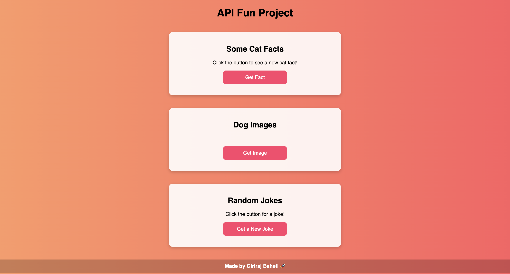

# 🐱🐶 API Fun Project 🎭  

A fun web project that fetches **cat facts, random dog images, and jokes** using APIs. This interactive page allows users to learn something new about cats, see adorable dog images, and enjoy random jokes with a single click!  

## 🚀 Features
- 🐱 **Cat Facts:** Displays interesting facts about cats using the `catfact.ninja` API.  
- 🐶 **Dog Images:** Fetches and displays random dog images from the `dog.ceo` API.  
- 😂 **Random Jokes:** Shows a random joke using the `official-joke-api`.  
- 🎨 **Modern UI:** A **beautiful gradient background**, stylish buttons, and interactive cards.  
- ⚡ **Fast & Responsive:** Uses **Axios** for efficient API calls and works smoothly on all devices.  

## 🖼️ Preview  

## 🛠️ Technologies Used  
- **HTML** → Structure of the webpage  
- **CSS** → Styling and layout (gradient, buttons, cards, etc.)  
- **JavaScript** → Fetching data from APIs & DOM manipulation  
- **Axios** → Handling API requests easily  
